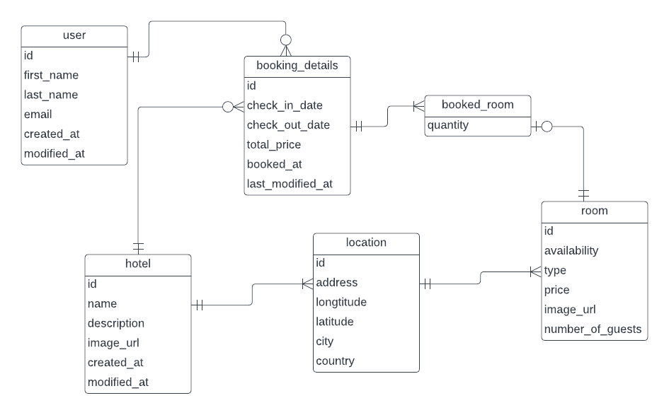
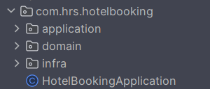

# Hotel Booking
## Business understandings and assumptions
### General assumptions:
#### Business:
1. Hotels may have multiple locations.
2. Each location can have various rooms differing in type and price.
3. Room prices are fixed per day.
#### Technical:
1. All API endpoints, except the search endpoint, require authentication.
2. Authentication uses a bearer token in the Authorization header. For simplicity, the user email is used as the bearer token, although it should be a JWT/JWE token.
3. Currently, there is no dedicated database table for analytics. For simplicity, analytics can be derived from logs.
### Search hotel feature:
- Implemented to search hotels by city only.
### Booking hotel feature:
- Users can book multiple rooms for a specific period (check-in to check-out date). 
- Room availability is determined by checking for overlapping bookings and calculating the remaining available rooms.
- Booking total price calculation:

  `Total price = SUM(room price * booked quantity * number of staying days) for each booked room type`

### Edit booking feature:
- Users can only edit the stay period within 2 days of the booking creation date.
- The same logic for checking room availability and price calculation as in [the booking feature](#booking-hotel-feature) is applied.
### Cancel booking:
- Users can only cancel bookings within 2 days of the booking creation date.
## Database ERD



## Project structure


1. `domain`: Corresponding to The Domain layer, contains all classes that will perform domain-specific business logic
2. `application`: Corresponding to The Application layer, Contains service classes used to orchestrate the steps required to fulfill the requests imposed by the client. Can be used to interact with database.
3. `infra`: Contains all classes that are related to the infrastructure such as database, security. REST controller classes are also in this package.
## Run locally
### Prerequisite
- Docker & Docker Compose
- Git CLI
### Start Server Locally
1. Clone the repo and go to the folder
    ```
    git clone https://github.com/HuyAtreides/HRS-Group-Hotel-Booking.git
    cd HRS-Group-Hotel-Booking
    ```
2. Run `docker compose up`
3. Access the API at http://localhost:8080. The API definition is available [here](https://www.postman.com/martian-meadow-963625/workspace/hrs-group-hotel-booking/api/3dbc78e0-7f0d-4d05-ae92-ce54b430aa90/definition/43dd5f74-8010-4c03-a822-ebb623268278?version=e7287f8c-7bd3-484b-87ec-c935e3d6932d). Note: Postman agent may be required for testing the API locally with Postman.


